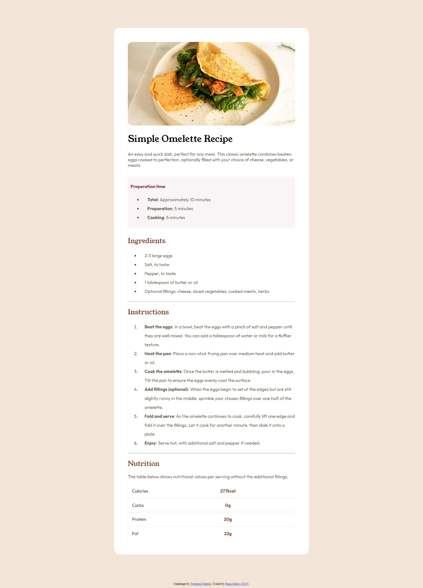

# Recipe website challenge

### This is a solution to the [Recipe page challenge on Frontend Mentor](https://www.frontendmentor.io/challenges/recipe-page-KiTsR8QQKm). Frontend Mentor challenges help you improve your coding skills by building realistic projects.

All I used is html and css but it was challenging as i learnt alot of new things.

- Website - [RanaPortfolio](https://portofolio-8jzk.onrender.com/)
- Frontend Mentor - [@RanaHafez](https://www.frontendmentor.io/profile/RanaHafez)

# Rana Hafez(2024)
